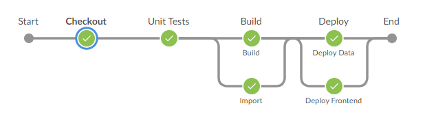

# Continuous Integration

[Jenkins](https://www.jenkins.io/) is used as tool for CI. It is self hosted in a Docker container at dev.pagelsdorf.de. In order to access the Jenkins Web UI an own account is needed. The pipeline itself runs without an account needed, but it's recommended in order to debug failed builds.

## Usage with GitHub

This project is represented in Jenkins as a [Multibranch Pipeline](https://plugins.jenkins.io/workflow-multibranch/). The [Git Plugin](https://plugins.jenkins.io/git/) is connected to this repository. Every new created git branch as well as every pull request gets an own branch in the pipeline. A new build is triggered on every new commit; for branches it's based on the code base of the branch, for pull requests it's based on a pre-merge based on the to branches to be merged. Beacuse of this it's possible to see build errors before actually merging two branches, just by watching the build of a pull request.

## Build Pipeline
The build pipeline is defined in the [Jenkinsfile](../../Jenkinsfile). Although it is possible to change the pipeline directly via BlueOcean, the Jenkinsfile is the place to look out in case of pipeline errors. As shown below, the pipeline has four steps. The checkout gets the code base, followed by tests, the actual Vue.js build (+ ESLint), as well as the data import and the deployment in the end.

## Deployment and Staging
The last pipeline step deploys every Jenkins branch to a designated stage, backend data and frontend. The original backend was dissolved, only the importer remains. It'll be triggered in every build, except when the converted data is younger than seven days. The importer post the JSON data to a designated S3 bucket; there is one for each Jenkins branch, frontend and backend divided. While the importer runs, the built frontend is being pushed to it's own S3 bucket. [Static website hosting via S3](https://docs.aws.amazon.com/AmazonS3/latest/dev/WebsiteHosting.html) is used for this matter. The stages have URLs in the following pattern:

`http://frontend-{{branchname}}.s3-website.eu-central-1.amazonaws.com`

Slashed are replaced by minus, so for example the branch "feature/continuous-integration" has the staging url `http://frontend-feature-continuous-integration.s3-website.eu-central-1.amazonaws.com`.

## Stage Cleanup
Buckets will not be deleted after a branch is deleted or a pull request is closed. In order to keep the buckets in our account (and the bucks in our bank-account) small, every week a Jenkins pipeline called "Cranach AWS CleanUp" is triggered via Crontab und deletes all buckets, so a new build creates the bucket new, older buckets won't be re-created. It has an own [Jenkinsfile](../../AWSCleanUp).
